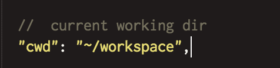
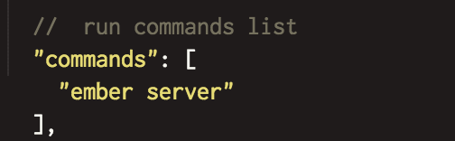

# Container Configuration

Right click on your Container and you will see your dropdown menu:

With Container get SSH access to your Container and you can use all the necessary actions such as git commands, installation of new depencencies ect! You can Turn Off or Turn On your Box, restart it or set it to be Always On so you can access your Box at anytime, without the need of logging into your account and starting it.

With containers, you can view your code with your preview link. You can check your preview link inside Info.
 

You can use your preview link or, if you want to used the one with specified port, be sure to replace the XX with the port you have specified in your app. Also, you can add ":port_number" at the end of your preview link.

In Config, you can set up commands necessary for your Stack to Run. 

Let's say, you have an app inside your workspace folder /path/to/folder/. 
By default current working dir is set to be /workspace/. By changing "cwd": "~/workspace" to "cwd": "~/workspace/path/to/folder", you can set the file path which will be used upon Runing your app.

cwd (curent working directory) is the location in which your run commands should be located. The default location is ~/workspace, if your commands are located in a subdirectory named "test” then cwd should be ~/workspace/test.

NOTE: containers hosting content via Apache (example: html, php) expect that content to be located at ~/workspace, if you keep your content in another directory you should edit or create the ~/workspace/.htaccess file to point at that directory.

Inside "commands" you can set any commands necesary for running your container.

In "commands": [], set command neccessary for running your app, such as: "grunt", "ember server", "rails server" ect, depending on your app.

If you changed port in your app, to listen to the port defined in your Config file, under "environment", feel free to set new port number which will use your app.

By selecting Run, your preview link will be opened and any command neccessary to run your app, opened in SSH terminal.

### Running on Localhost

Some of our stacks will default the IP to the localhost: 127.0.0.1. You have to change the default IP so your Container could run externally. Please change IP address on your container from 127.0.0.1 to 0.0.0.0 so that you could be able to preview your Ruby box. You can do that inside Config - under commands - of your container (right click on your container and select Config).

For example, on Ruby stack, you just have to use the following command in order to run your Rails container: "rails s --binding=0.0.0.0" This will override localhost (127.0.0.1) where your app can't work. And now, you'll be able to view your Ruby app on: preview.xxxxxx.box.codeanywhere.com:3000.

### Locate Private and Public

You can view Keys of your container by going to cd /home/cabox/.ssh/ using your SSH terminal. There you will find: 
- id_rsa - private key container of your container, 
- id_rsa.pub - public key of your container.
