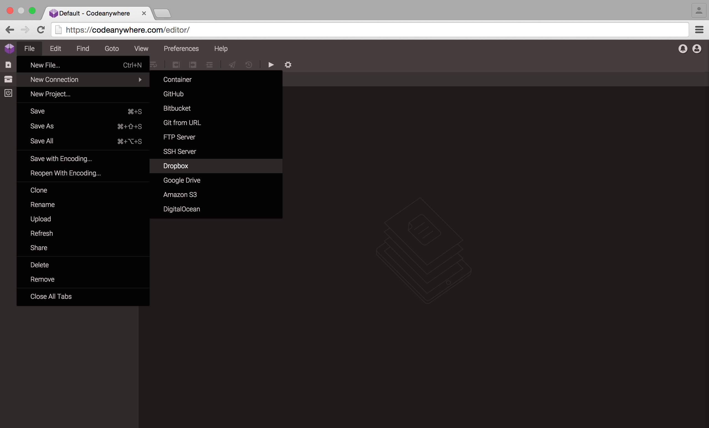
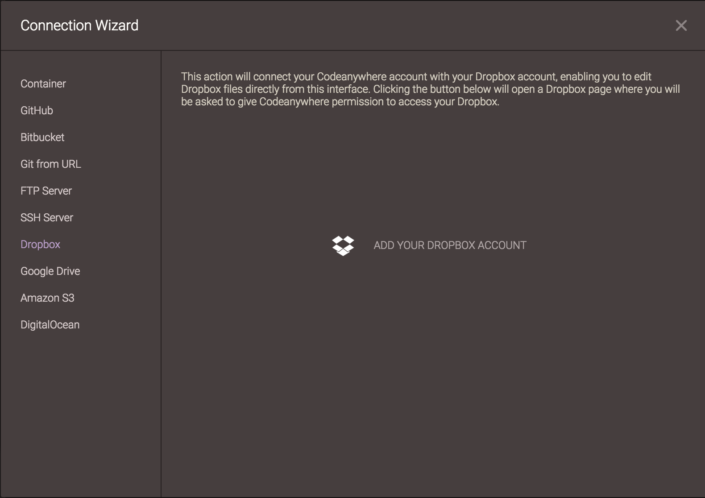
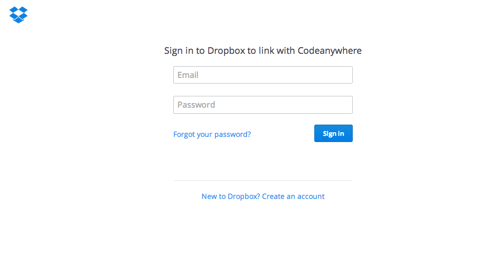

# Dropbox

Go to File -> New Connections -> Dropbox.

After selecting it, Add Dropbox Access window appears. Click on "Add your Dropbox Account" in order to proceed.

Enter your Dropbox account details to add that Dropbox account to your server list for quick and easy access.
 

If the Dropbox account is added successfully it will appear in your File Explorer with the Dropbox icon.
