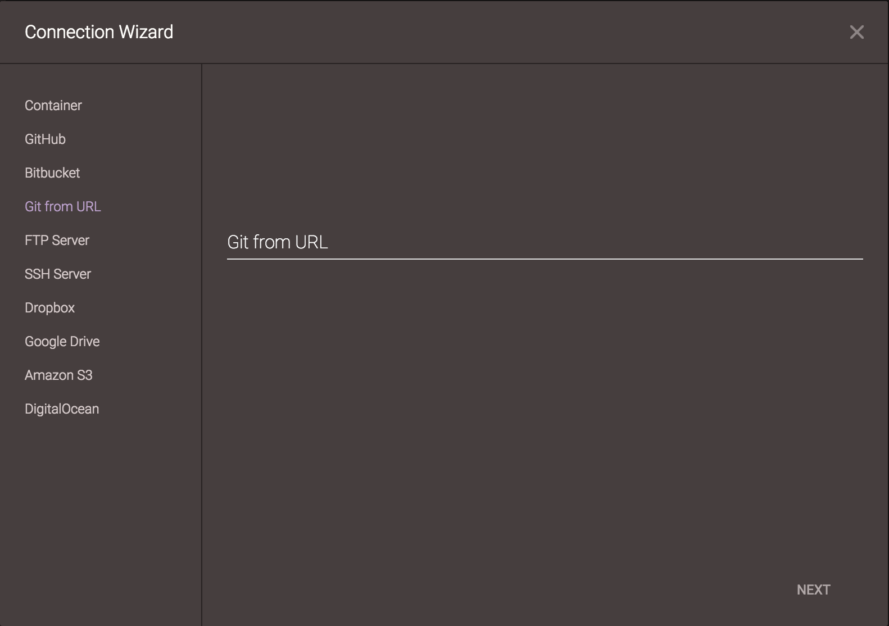
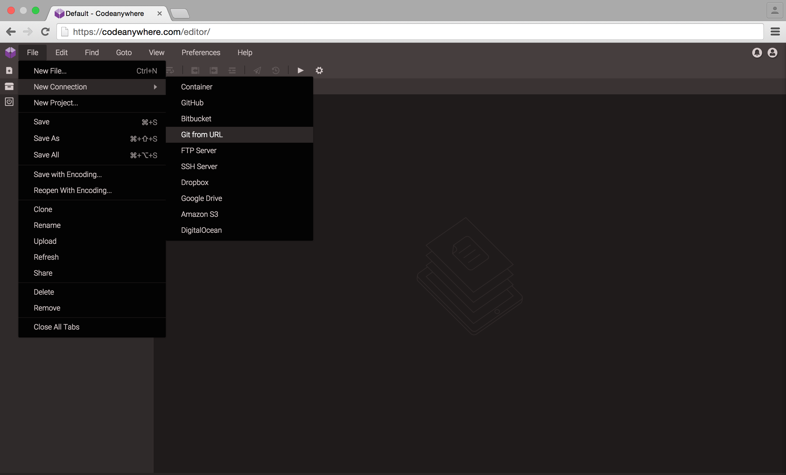

# Git from URL

### Creating an Git Container from URL

Go to File -> New Connection -> GitFromURL

You can connect to your repository by entering your repository url in Git from URL form!

Select a Stack and a name and you’ve created a new [Container](http://docs.codeanywhere.com/connections/container.html) with your repository!
