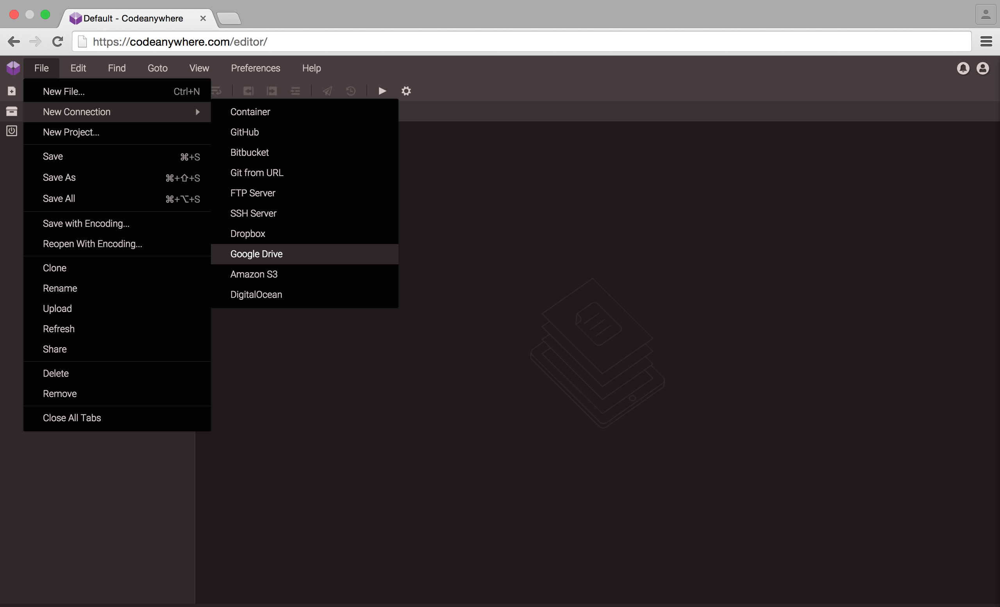
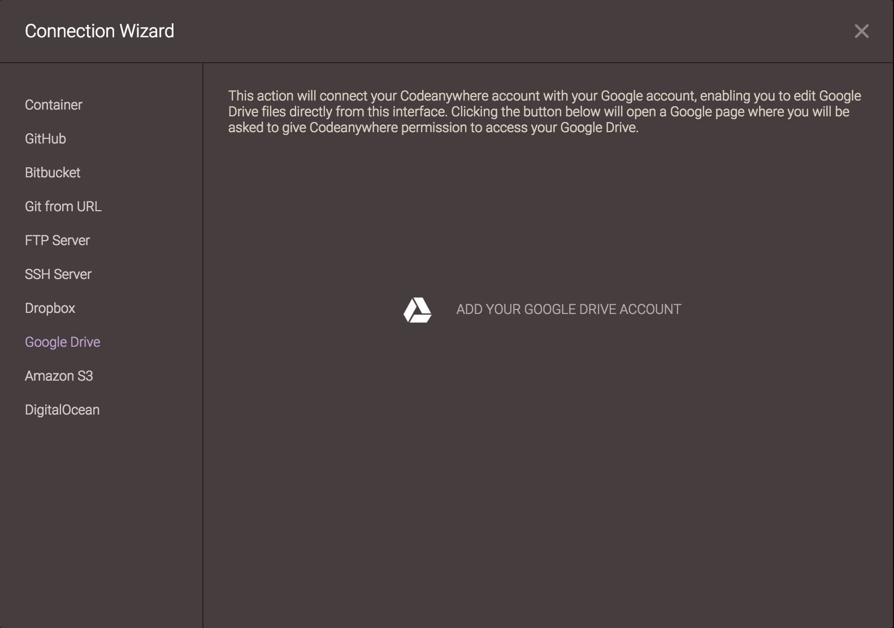
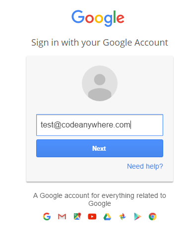

# Google Drive

With Codeanywhere, you can connect your Google Drive account!

### Adding a New Connection to Google Drive

Go to File -> New Connections -> Google Drive.

After selecting it, Add Google Drive Access window appears. Click on "Add your Google Drive Account" in order to proceed.

Enter your Google Drive account details to add that Google Drive account to your server list for quick and easy access.

If the Google Drive account is added successfully it will appear in your File Explorer with the Google Drive icon.
Now you can easily edit files from your Google Drive account!

### Invalid Token issue

If you receive an Invalid Token error, it means there is something wrong with your long-term access token, so please try removing and adding your Drive account. If that does not work please try revoking access to Codeanywhere from your Google security page located at: [https://www.google.com/settings/security](https://www.google.com/settings/security) - under Connected apps and sites, Remove Codeanywhere, and afterwards add it again.

