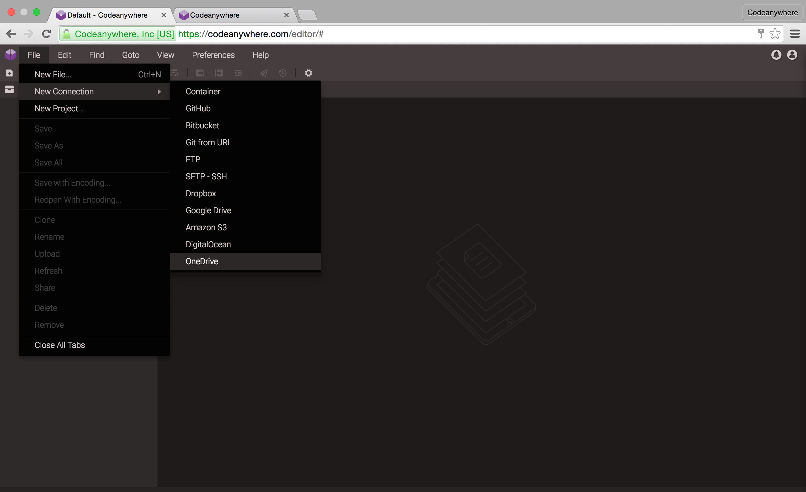
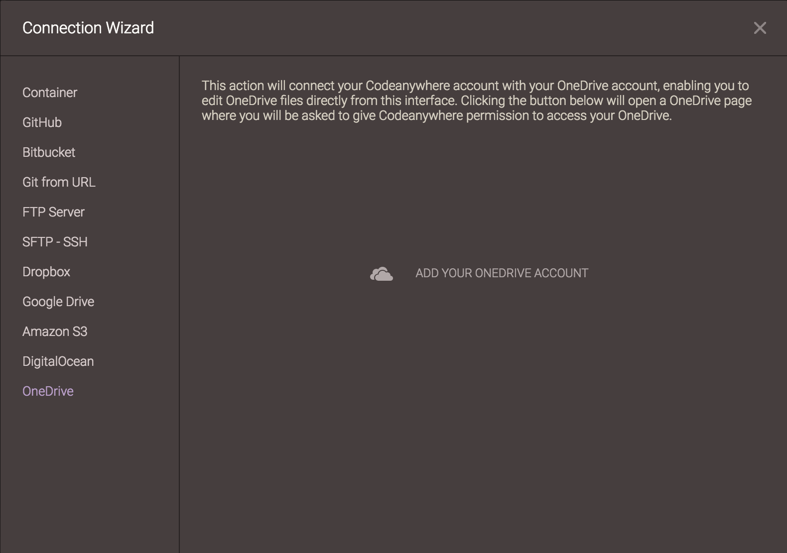

# OneDrive

With Codeanywhere, you can connect your OneDrive account!

### Adding a New Connection to OneDrive

Go to File -> New Connections -> OneDrive.

After selecting it, Add OneDrive Access window appears. Click on "Add your OneDrive Account" in order to proceed.

Enter your OneDrive account details to add that OneDrive account to your server list for quick and easy access.

If the OneDrive account is added successfully it will appear in your File Explorer with the OneDrive icon.
Now you can easily edit files from your OneDrive account!