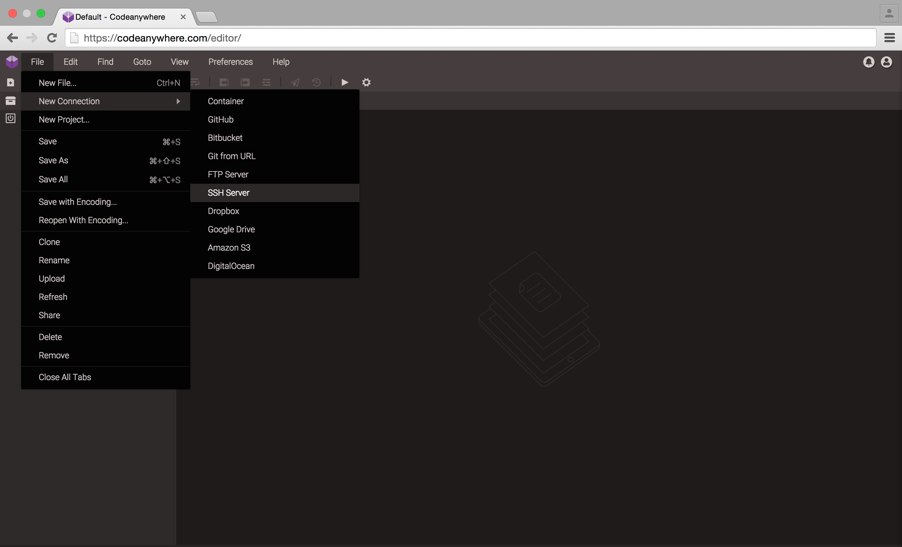
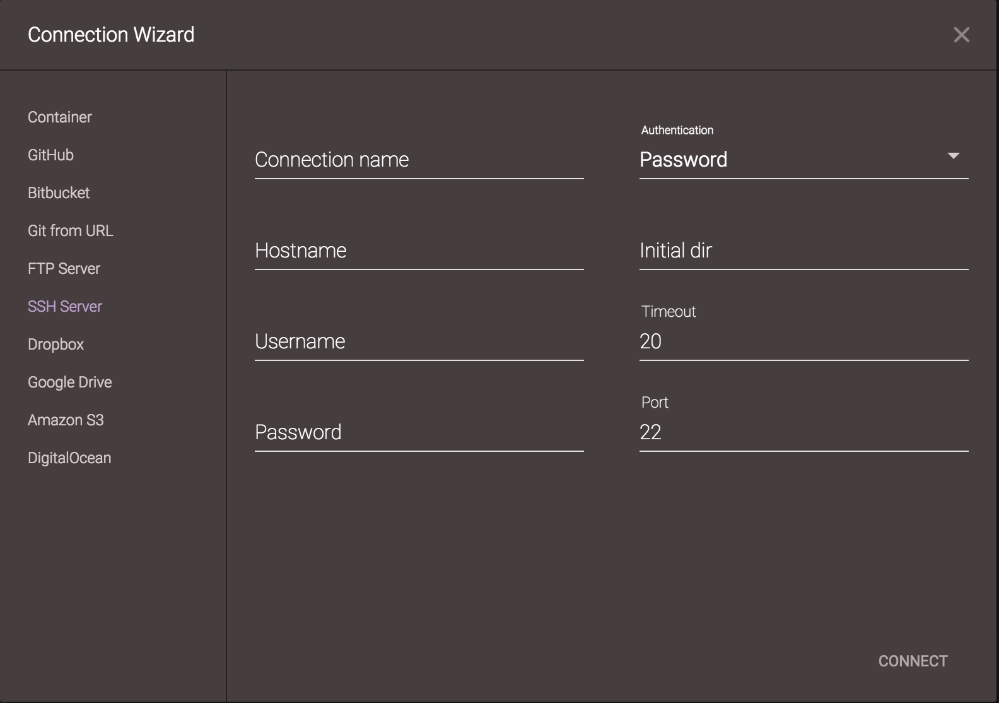

# SSH Server

With Codeanywhere, you can connect your existing SSH/SFTP server!

### Adding an existing SSH

Go to File -> New Connection -> SSH Server. 

After selecting it, Add SSH window appears where you enter server information and add that server to your Project for quick and easy access.
-	Server name - the name which will be shown in File Explorer, it is user definable, meaning you can name your server however you want
-	Hostname - the hostname or IP address of your server (example: ssh.mywebsite.com)
-	Username - username of your SSH/SFTP server
-	Password - password of your SSH/SFTP server
- Authentication - use different type of authentication: Password, Public Key, Private Key
- Initial dir - set path
- Timeout - default: 20
- Port - default: 22

Your SSH/SFTP server will be automatically added to the File Explorer with an SSH icon.
If you right-click on any SSH server listed, it will expand a menu offering more options: Rename, Permissions, Refresh, Create File, Create Folder, Upload, Share, Remove and Settings – where you can change your SSH credentials.

### Local SSH

Codeanywhere uses its file services in the cloud that are used for making connections.
Behind the scenes it looks something like this: 

Codeanywhere Web or mobile app ----> Codeanywhere API ----> Codeanywhere File Service ----> Your SSH/SFTP Server

If your SSH server is in your local network, the only way you could connect to your server from Codeanywhere is that you use port forwarding on your router to your local SSH server. The other problem that could come in your case is your router's public IP. If your internet provider does not provide you a static IP, then you would also need to use some of DDNS services.

### Server response

While working with FileZilla you are directly connected from local computer to your server, on the other hand the Codeanywhere is acting as a "middle man" between user and SSH - any action done by user is firstly processed at our server and then sent to the SSH. Same thing works in opposite direction, SSH sends response to Codeanywhere and then Codeanywhere forwards the response back to user.
Also, the speed of the server response is depending on the server location. If your server is located it America, the response will be faster, but if it's located in China it will be slower. 
We do plan to expand our server coverage around the world for faster connections!

