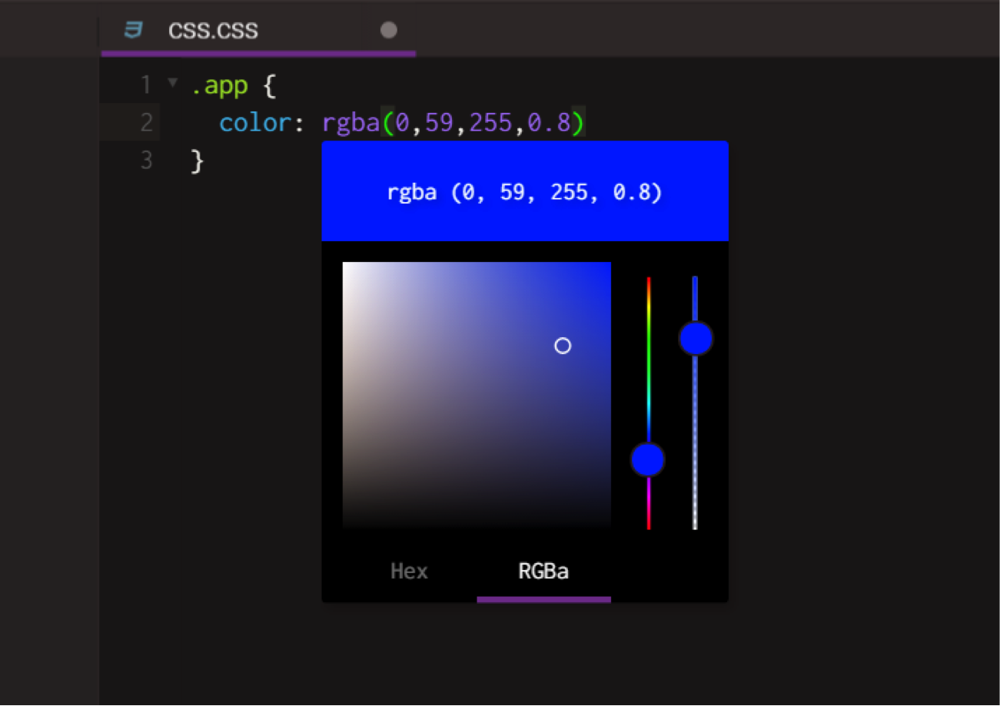

# Color Picker

The Color Picker makes it easy to create, adjust, and experiment with custom colors for your web site or application. Also it makes it easy to convert between HEX, RGB and RGBa color formats.

Color Picker is available in any file. You can open the Color Picker by hitting on Ctrl+Alt+K (PC) or CMD+Alt+K(MAC). It will appear as a pop-up near or below a text input field, allowing the user to select a color value, either decimal or hexadecimal (or both), by choosing the color with a mouse click, also the left slider selects the color code and right slider selects opacity value.

To close the Color Picker hit Enter, Esc or click outside Color Picker window. 

