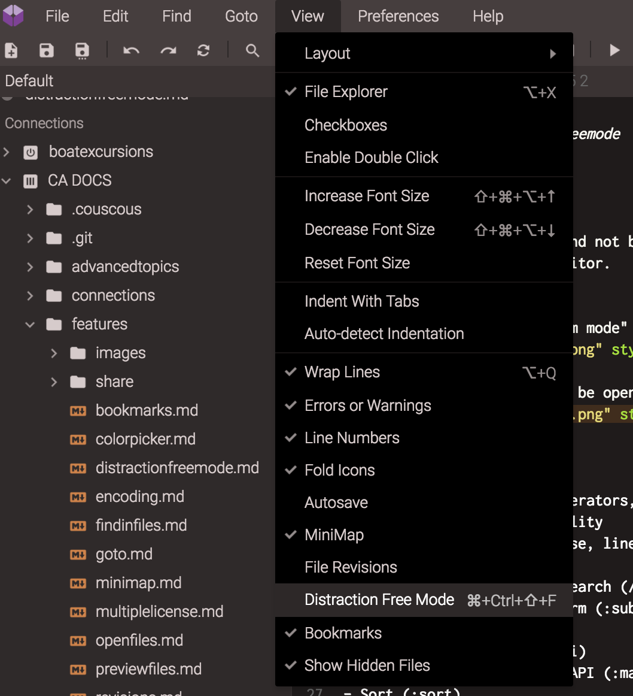

# Distraction Free Mode

If you want to use Codeanywhere and focus only on your code, you can enable "Distraction Free Mode", which hides all UI except the editor.

To enable it, use one of the following options:
- Main menu (View -> Distraction Free Mode)
- key shortcut (Shift-F11 for PC or Cmd-Ctrl-Shift-F for mac)
- "Goto Anything -> Enable Distraction Free Mode"

To disable it, use one of the following options:
- the "Esc" key
- key shortcut (Shift-F11 for PC or Cmd-Ctrl-Shift-F for mac)
- "Goto Anything -> Disable Distraction Free Mode".