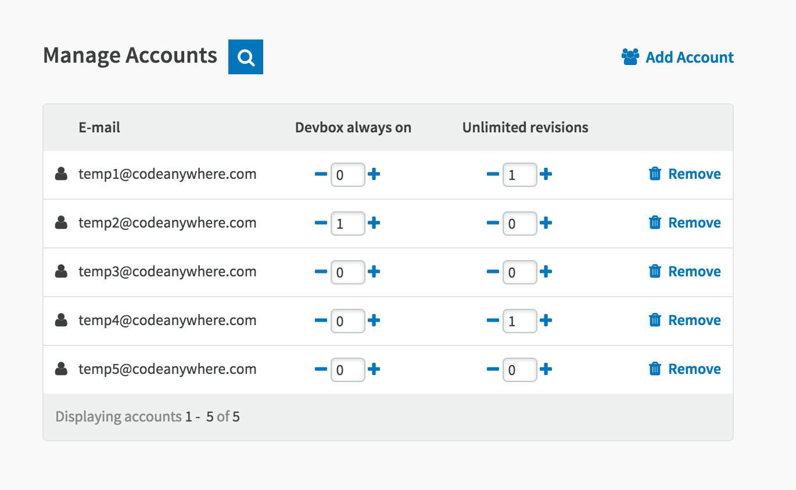

# Multiple Licenses

If you’re managing a huge number of employees, or if you are just a small team, Codeanywhere’s feature Multiple License, enables you to manage your entire team accounts, including which plans, add-ons and permissions they have. 

 
Once you have set up and upgraded your primary Codeanywhere account to a Premium Plan, you can easily add additional accounts over which you have complete control. Management of this feature is done through your Dashboard and it consists of creating new, or adding existing accounts under your management, granting of add-ons and, if necessary, closing the accounts.
