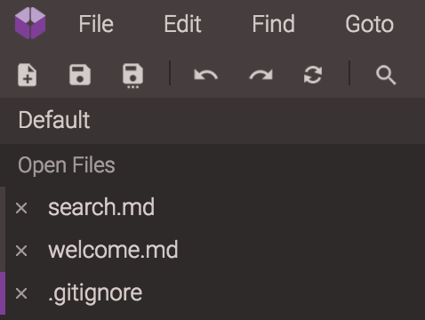

# Open Files

At the top of the Explorer is a section labeled Open Files. This is a list of active files or previews.

With Open files feature, you can:
- Switch between files
- Close files
- See currently active file
- Check which files are unsaved

You can also disable or enable this feature by using [General Preferences](../preferences/general.html)
