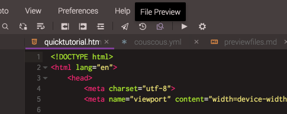
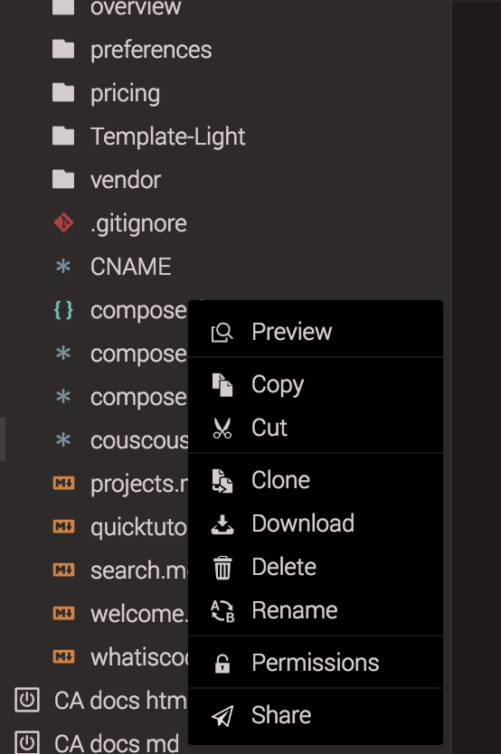
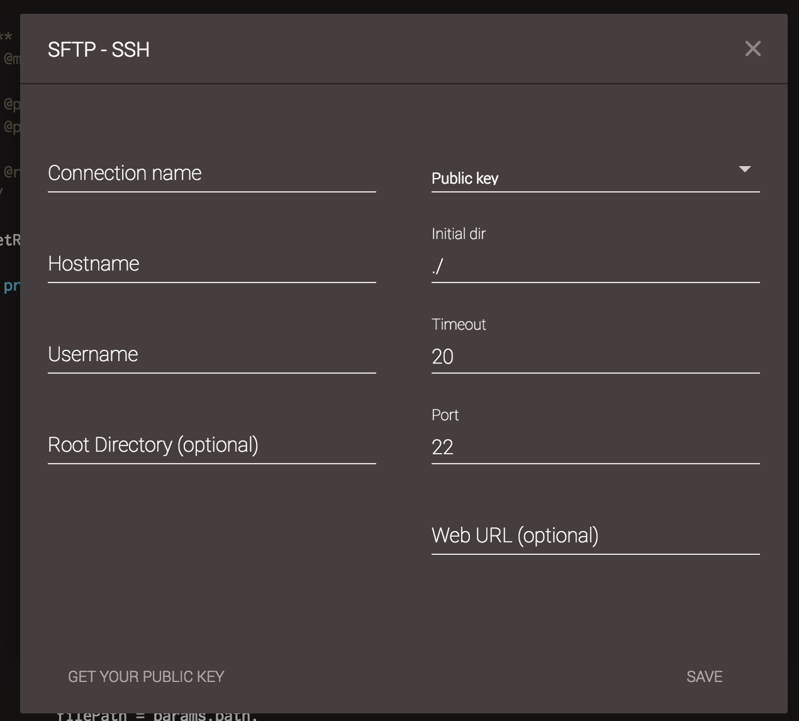

# Preview File

To preview a file you can click on a "File Preview" icon while file is open

Or you can right click on a file in the file tree and then click "Preview"

## Setting up preview file parameters

### Remote connections (FTP, SFTP, FTPS, SSH)

You can setup preview parameters while adding a new remote connection, or you can edit the existing connection. To edit existing connection, right click on a connection and click settings

You should see popup like this

Parameters Root Directory and Web URL are required to preview a file.

Root directory is the directory from which your site is served (e.g. './' or '/var/www/html')

*NOTE: Root directory needs to be in the same format as initial dir, if initial dir contains absolute/relative path so should Root directory too*

Web URL is base URL of your server (e.g. 'https://myserver.com')

### Containers

Codeanywhere gets preview file information from Container's config file. Base preview URL is defined from run[0].preview.url property of config file. Preview root dir is by default '/home/cabox/workspace'.
If you want to change preview root dir, you can define property run[0].preview.path. Make sure that path is in absolute format, and it will calculate the URL relative form '/home/cabox/workspace'.
