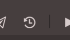

# Revisions

Every time you save a file on Codeanywhere, a diff of any changes made to it is saved by the server. Over time, you can view these file revisions as content is added and removed from your files. You can also restore a file to any previously saved state; you'll never have to worry about losing your work ever again!
To access file revisions, you simply click on revision button located in toolbox above Codeanywhere Editor.
 

This will open the Revisions History panel.
	
Once you select the revision you want, the "Compare window" appears:

In Compare window you can see the changes between current file and saved revision. Pressing the arrow key "<<" you can transfer the code from revision to your file and once you are done with editing, simply press the "save" button at the bottom to confirm your changes.
