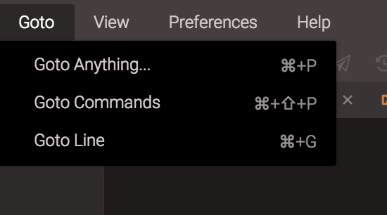

# Searching and Replacing in Files

## Quicksearch

Quicksearch can be activated by hitting Cmd-F on a Mac, or Ctrl-F on a Unix/Windows machine. As you type in the quicksearch bar, the code with the matching text is underlined, and if you want to move between the matching results you can use the arrow keys on the right side which will instantly shift you to the next available result. This is a great way to quickly search around in your code without hassle.

Quicksearch offers the following options:
●	Regular Expressions: when enabled, your search is treated as a regular expression
●	Match Case: when enabled, your search is case sensitive

## Search and Replace

Building on the features of quicksearch, search and replace allows you to replace segments of code in your file. 
Replacing offers two options like quicksearch:
●	Match Case: when enabled, your search is case sensitive
●	Regular Expressions: when enabled, your search is treated as a regular expression

### GoTo (Find in Files)

In order to search across a set of files, you'll want to use the Goto Files feature. Here, you can search of a string or regular expression, within your entire File Explorer. You can also filter based on extensions, like .html or .php.
It is located on top of File Explorer and is represented by magnifying glass icon and the "Find" text.

In your Top Menu Bar, you can find a GoTo option. With it, you can check all the options for easier search!
 

### GoTo Anything

Shortcut for this function is, for Mac, CMD + P, or, for Windows, CTRL + P.  After you start typing the name of your file/folder, you’ll be able to activate it without any hustle!

### GoTo Commands

Shortcut for this function is, for Mac, CMD + Shift + P, or for Windows, CTRL + Shift + P. This feature will enable you to go to feature you can use with Codeanywhere!

### GoTo Line 

Shortcut for this function is, for Mac, CMD + G, or for Windows, CTRL + G. You can go to any line in your currently opened file!
