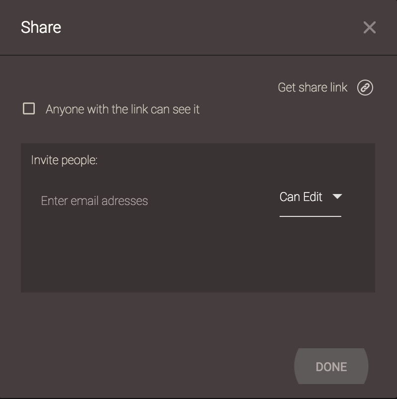
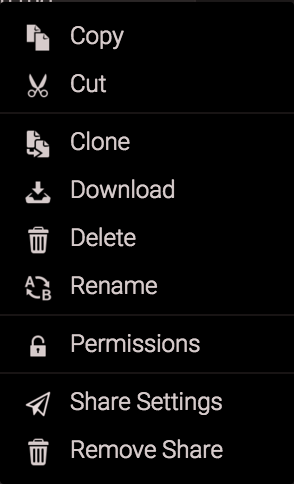
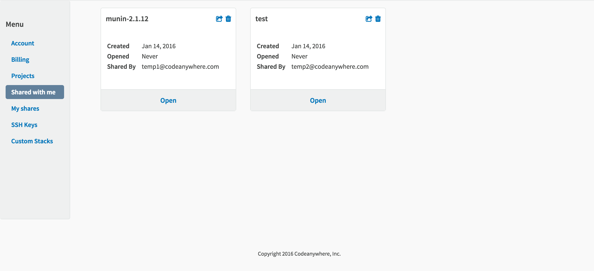

# Share

Share with Codeanywhere is an amazing feature that lets you do more than just share your projects with any other Codeanywhere developer. You can grant someone else access to change files on your server, in real-time - or just let them view the files without any other rights. 

To share your files on Codeanywhere, simply right click on Project, Connection, Folder or File you'd like to share and select Share. You'll be prompted to enter e-mails of the users you'd like to collaborate with. 

In the Email field you can enter the email of the user that you want to share your file to. 
You can also set permissions for that share. Permissions are located on the right side and allow you to choose what limitations will your friend have while working on your project. You can choose between "Can Edit" and "Can View".

## Share Settings

If you're worried about the sanctity of your code after grant access to other developers, fear not. You can always take a look at a File Revision history to view line-by-line changes made to your project over time.
The Share can be removed by right-clicking the file/folder in you File Explorer and selecting the "Remove share" from context menu:

In order to easily manage your shares, just go to your [Dashboard](https://codeanywhere.com/dashboard) and locate them under My shares. 

Also, here you can check who shared files with you under Shared with me. 

  - [Pair Porgramming](share/collaboration.html)
  - [Share Link](share/sharelink.html)
  - [SSH Collaboration](share/sshcollaboration.html)