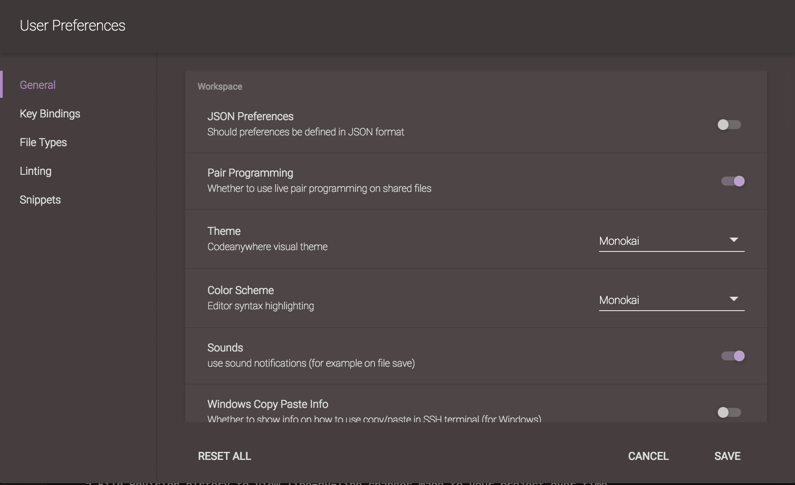

# Pair Programming

If you wish to pair code with other users, you must first enable "Pair Programming" option in User or Project Prefrences

Now, all users which have access to your shared files and have this option enabled as well will see each other cursors in the real time. 

You can see who is currently working on the file by the initials in top-right corner of the screen, and if you hover over it will display the email of the user:

