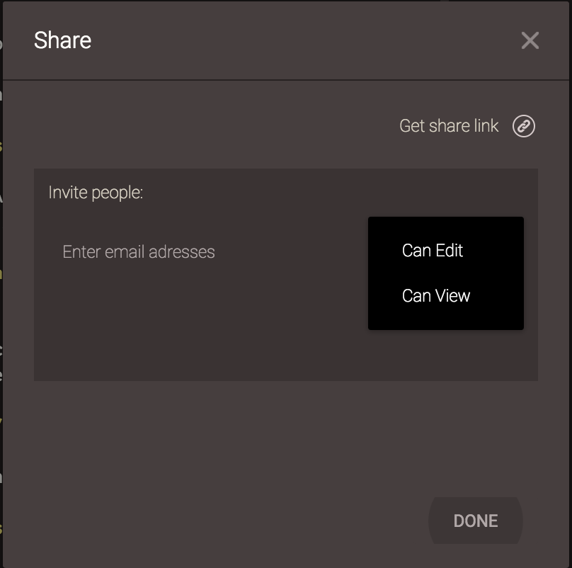
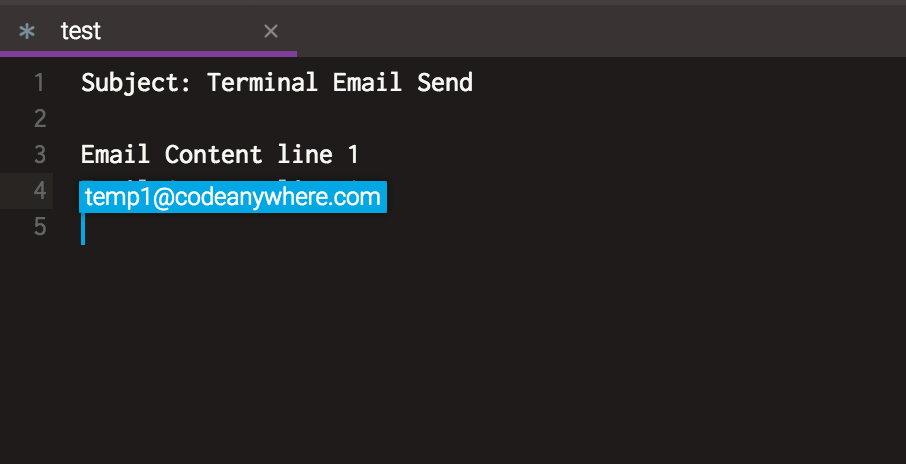
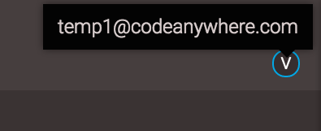

## Pair-coding – Collaboration

Simply right click on Project, Connection, Folder or File you'd like to share and select Share. You'll be prompted to enter e-mails of the users you'd like to collaborate with. 

In the Email field you can enter the email of the user that you want to share your file to. 
You can also set permissions for that share. Permissions are located on the right side and allow you to choose what limitations will your friend have while working on your project. You can choose between "Can Edit" and "Can View".

Once the Share is made, you can pair code with other user (which has access to your shared files) immediately - simply open the shared file and start coding. If both you and the other user are working on same file at the same time you will see each other cursors as well as the changes in real time. 

You can see who is currently working on the file by the initials in top-right corner of the screen, and if you hover over it will display the email of the user:

If you're worried about the sanctity of your code after grant access to other developers, fear not. You can always take a look at a File Revision history to view line-by-line changes made to your project over time.
The Share can be removed by right-clicking the file/folder in you File Explorer and selecting the "Remove share" from context menu:

In order to easily manage your shares, just go to your [Dashboard](https://codeanywhere.com/dashboard) and locate them under My shares. 

Also, here you can check who shared files with you under Shared with me. 

