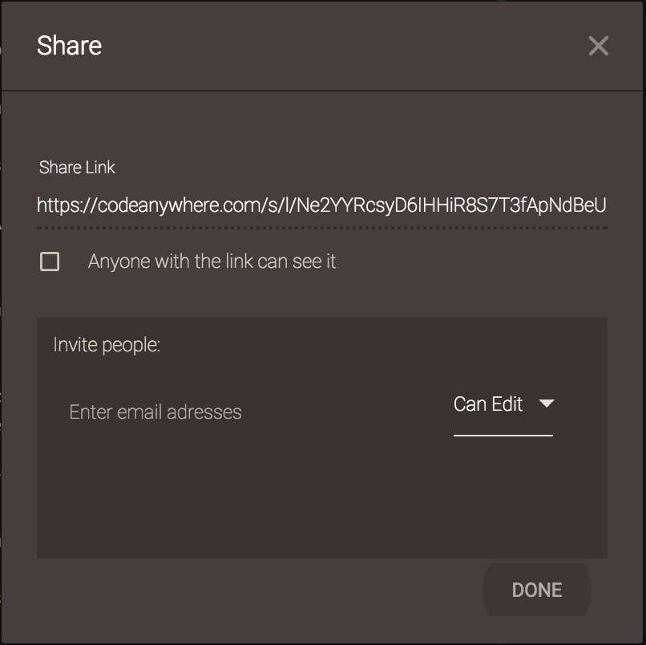

## Share Link

To share files with anyone, simply right-click on Project, Connection, Folder or even File in File Explorer and select the Share button. 
	
Share Link is located on the top of the window, simply copy the Share link and send it to your friend or coworker and they can open the shared file by pasting the link in their browser:

