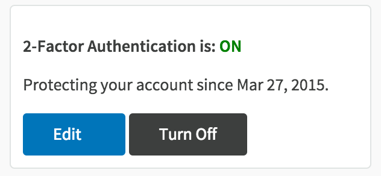
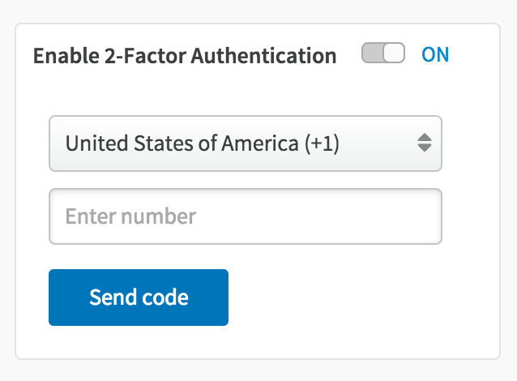

# Two Factor Authentication

When you are logging into your account using only your username and password, or any of our oAuth methods, it is considered a single factor authentication. Two factor authentication adds a second level of authentication to an account log-in by sending additional set of numbers to your mobile device when first logging to your account from some new device!

At Codeanywhere, we decided to provide our users with 2FA, in a way to use SMS to deliver that second factor of authentication because it is considerably universal - all you need is a mobile phone to receive your login code! You can set everything up in your Dashboard under Billing!

After turning this feature on - enter your mobile number:

And that’s it! You’ll be prompted whether you’d like to trust your current device, so you don’t have to enter your code each time you want to log in!

It definitely pays off to be a little patient and spend some extra time to ensure that all of your data is under high level of security! 
Now you can be sure that all the codes you’ve been working on will remain safe and sound! 
This feature is only available on Freelancer Plan and higher!
