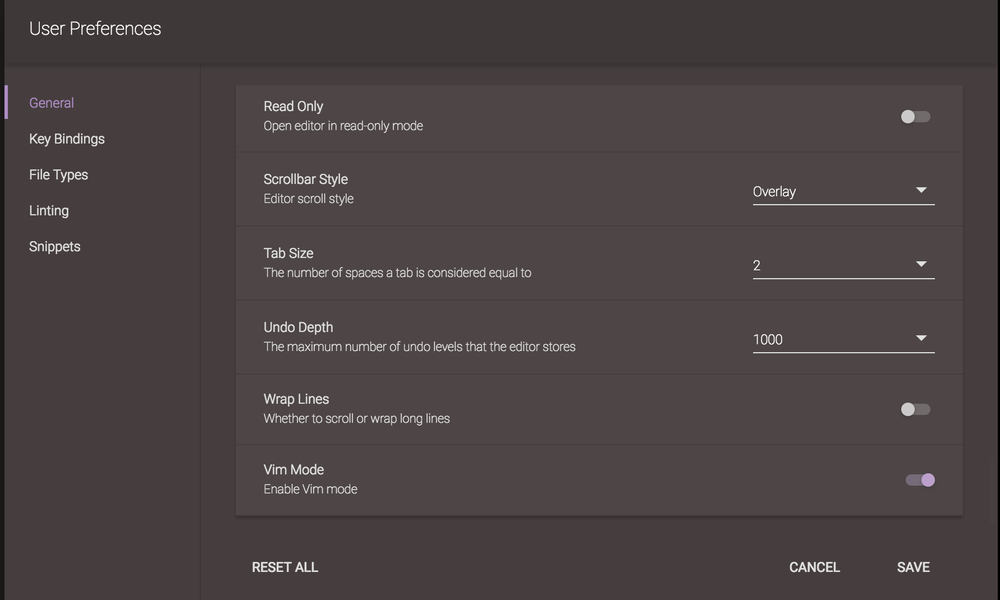
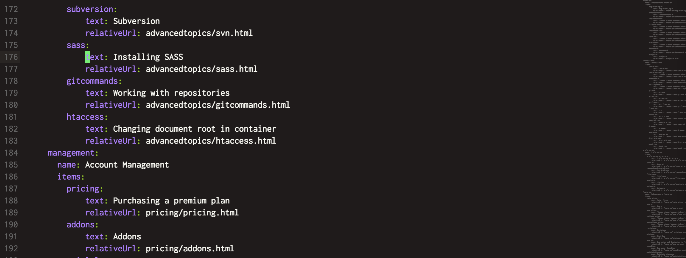
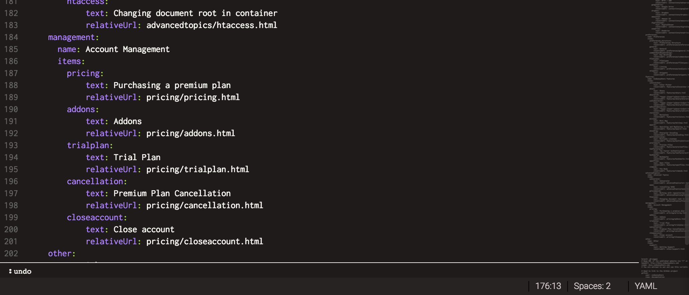

# Vim Mode

If you want to use Vim keybindings in your Codeanywhere, you can enable them in "General preferences":

When enabled, in "normal vim mode" you should see a green thick cursor like the one below:

"command-line vim mode" can be opened using the ":" key:

## Features

- All common motions and operators, including text objects
- Operator motion orthogonality
- Visual mode - characterwise, linewise, blockwise
- Full macro support (q, @)
- Incremental highlighted search (/, ?, #, *, g#, g*)
- Search/replace with confirm (:substitute, :%s)
- Search history
- Jump lists (Ctrl-o, Ctrl-i)
- Key/command mapping with API (:map, :nmap, :vmap)
- Sort (:sort)
- Marks (`, ')
- :global
- Cross-buffer yank/paste