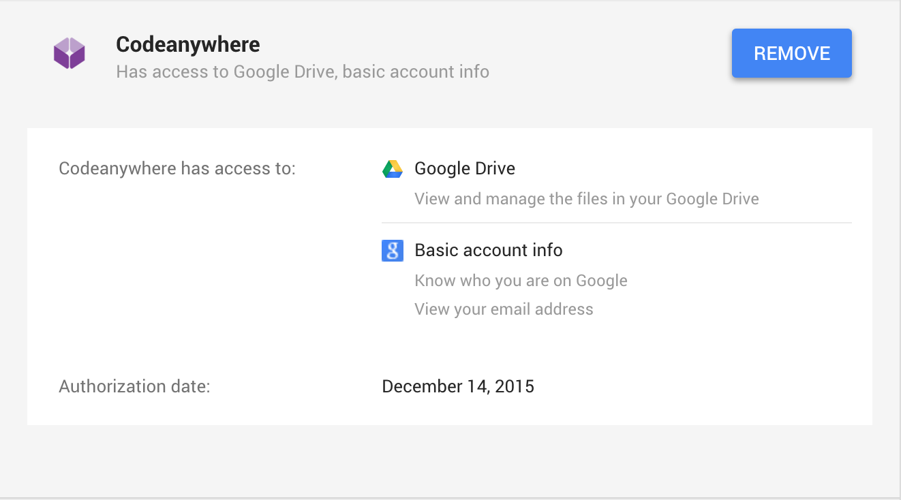

# FAQ


### How can I preview my code?

You will need to copy your code into a Container. Containers are basically Virtual Machines and you can use them for all your coding. Each one with its own amount of RAM, Disk space and Processing power. Containers give you the ability to provision any Development Environment you like. You can even choose between one of the predefined stacks. Place your code in, right click and select Run and that's it! If you need a quick tutorial for setting this up, check [here](http://docs.codeanywhere.com/quicktutorial.html). You can also check [here](http://docs.codeanywhere.com/connections/container.html) for more details on Containers!


### How can I use Git with Codeanywhere?

Codeanywhere will create a [Container](http://docs.codeanywhere.com/connections/container.html) for each repository and you will be able to edit your code directly from there. Then, you can push changes back to your repo using your SSH Terminal! Just check our [Working with Repositories section](http://docs.codeanywhere.com/advancedtopics/gitcommands.html) for further instructions.


### Why is working with FTP slower on Codeanywhere than with the FileZilla?

While working with FileZilla you are directly connected from local computer to your server, on the other hand the Codeanywhere is acting as a "middle man" between user and ftp - any action done by user is firstly processed at our server and then sent to the ftp. Same thing works in opposite direction, ftp sends response to Codeanywhere and then Codeanywhere forwards the response back to user.
Also, the speed of the server response depends on the server location. If your server is located it America, the response will be faster, but if it's located in China it will be slower. 
We do however plan to expand our server coverage around the world for faster connections.


### How can I connect to Local Server?

Codeanywhere uses its file services in the cloud that are used for making connections.
Behind the scenes it looks something like this: 

Codeanywhere Web or mobile app---->Codeanywhere API---->Codeanywhere File Service---->Your Server

Your server is in your local network and the only way you could connect to your server from Codeanywhere is that you use port forwarding on your router to your local server. The other problem that could come in your case is your router's public IP. If your internet provider does not provide you a static IP, then you would also need to use some of DDNS services.


### Why is my server not responding after I made few requests, but after an hour works fine again?

While performing actions using Codeanywhere, the requests are sent from our app to your server. Sometimes the number of requests cause your server to block the requests and add Codeanywhere to a blacklist. To avoid this you must make sure that your server is reachable from the following IP addresses:

 - 65.52.184.164
 - 51.141.5.180
 - 52.161.27.120
 - 54.187.136.143
 - 54.187.142.118
 - 54.187.182.165
 - 54.187.44.75

If you have no administration rights on the server, please ask your administrator to whitelist these IP’s.

### How to connect local machine to a Container via Putty?

Here are the complete instructions for connecting to your container with Putty:

To generate a set of RSA keys with PuTTYgen: 
	1. Start the PuTTYgen utility, by double-clicking on its .exe file
	2. For Type of key to generate, select SSH-2 RSA
	3. In the Number of bits in a generated key field, specify either 2048 or 4096 (increasing the bits makes it harder to crack the key by brute-force methods)
	4. Click the Generate button 
	5. Move your mouse pointer around in the blank area of the Key section, below the progress bar (to generate some randomness) until the progress bar is full
	6. A private/ public key pair has now been generated
	7. In the Key comment field, enter any comment you'd like, to help you identify this key pair, later (e.g. your e-mail address; home; office; etc.) -- the key comment is particularly useful in the event you end up creating more than one key pair
	8. Click the Save public key button & choose whatever filename you'd like (some users create a folder in their computer named my_keys)
	9. Click the Save private key button & choose whatever filename you'd like (you can save it in the same location as the public key, but it should be a location that only you can access and that you will NOT lose! If you lose your keys and have disabled username/password logins, you will no longer be able log in!)
	10. Right-click in the text field labeled Public key for pasting into OpenSSH authorized_keys file and choose Select All
	11. Right-click again in the same text field and choose Copy.

Container config: 
	1. Log on to your container 
	2. Run: vim ~/.ssh/authorized_keys 
	3. Paste key in new line 
	4. Save and exit

Putty config: 
	1. Start PuTTY by double-clicking its executable file; 
	2. PuTTY's initial window is the Session Category (navigate PuTTY's various categories, along the left-hand side of the window); 
	3. In the Host Name field, enter the Container’s Host Name (hostXX.codeanyhost.com) 
	4. Enter the port number in the Port field (see Container info) 
	5. Select SSH under Protocol; 
	6. Along the left-hand side of the window, select the Data sub-category, under Connection; 
	7. Specify the username cabox in the Auto-login username field; 
	8. Expand the SSH sub-category, under Connection; 
	9. Highlight the Auth sub-category and click the Browse button, on the right-hand side of the PuTTY window; 
	10. Browse your file system and select your previously-created private key; 
	11. Return to the Session Category and enter a name for this profile in the Saved Sessions field 
	12. Click the Save button for the Load, Save or Delete a stored session area.
	13. Click on the desired connection and then “connect”

### How can I connect to the SSH of my Container (Linux and OSX)?

1. open your Terminal
2. type in ssh-keygen and you will create your public key
3. go to .ssh/id_rsa.pub and copy your entire key
4. In Codeanywhere, in Container's SSH, use command: cat .ssh/id_rsa.pub
5. use command vim authorized_keys
6. (type "A" or "I") paste your key in new line and Save (by pressing ESC, and entering :wq)
7. Locate SSH port number in Container's Info

Now in order to connect to your box, you have to use the following command to create a tunnel from your local machine to your Container:
```sh
ssh -p port cabox@hostXX.codeanyhost.com -i id_rsa
```

### How to connect local MySQL to a Container?

After connecting to your local machine via Putty or Terminal, connect to your remote MySQL using: localhost:3306


### How can I connect to a Container via FTP?

You can't connect via FTP but you can connect as SFTP. These are the credentials you'll need: 
- Hostname: hostname of your container - looks something like hostXX.codeanyhost.com and you can check it in Container's Info with a right click on your Container 
- User name: cabox 
- As for the password, you can't connect this way. You'll need private key of your Container and you can get it by going to /home/cabox/.ssh/id_rsa and that's your private key which you can use for connecting to your Container. 
- Also, you'll need to check your Port - right click on your Container, select Info, locate SSH Terminal listening on port, and that's the port you have to use for connecting to SFTP.

### How can I find private and public key of my Container?

You can view Private Key of your container by going to cd /home/cabox/.ssh/ using your SSH terminal. There you will find: 
- id_rsa - private key container of your container, 
- id_rsa.pub - public key of your container.

### Is it possible to deploy to Heroku?

Deploying with Heroku requires you to install Heroku toolbelt. You can install it using SSH command:

```sh	
	wget -O- https://toolbelt.heroku.com/install-ubuntu.sh | sh
```

Now you can use Heroku CLI. More detailed instruction can be found on official Heroku toolbelt website https://toolbelt.heroku.com/


### Why doesn't my stack work on 127.0.0.1:port?

Some of our stacks will default the IP to the localhost: 127.0.0.1. You have to change the default IP so your Container could run externally. Please change IP address on your container from 127.0.0.1 to 0.0.0.0 so that you could be able to preview your Ruby box. You can do that inside Config - under commands - of your container (right click on your container and select Config). 


For example, on Ruby stack, you just have to use the following command in order to run your Rails container: "rails s --binding=0.0.0.0" 
This will override localhost (127.0.0.1) where your app can't work.	
And now, you'll be able to view your Ruby app on: containername-username.codeanyapp.com:3000.


### In a Wordpress stack, after uploading plug-ins, I receive an error and permission is denied. Why?

You can prevent these issues by running commands in SSH: 
- Ubuntu: 
```sh
	sudo chown cabox:www-data -R ~/workspace 
```
- CentOS: 
```sh
	sudo chown cabox:apache -R ~/workspace
```

Also, please download original plug-ins from Wordpress, so you don't receive this error again. 


### I receive the following error when trying to access Google Drive: Invalid token. What could cause this?

There seems to be something wrong with your long-term access token, so please try removing and adding your Drive account. If that does not work please try revoking access to Codeanywhere from your Google security page located at: [https://www.google.com/settings/security](https://www.google.com/settings/security) and afterwards try to add it again.




### How can I change Preferences? All I get is a JSON file.

In our current version, it is possible to override settings from Preferences -> Default, inside Preferences -> User/Project.

For example, in Preferences -> Default -> General, you'll see it is set to: 
```
"workspace": { 
	"theme": "monokai" 
} 
```
And now you can change it inside Preferences -> User/Project -> General, by adding code:
```
"workspace": { 
	"theme": "white" 
}
```
And by doing this, you'll override settings from Default. We'll keep updating this so stick around!


### How can I connect to Bitbucket via authorized_keys

The recommended method is adding Codeanywhere SSH key to your Bitbucket account. That way, you can push commits to your private repo without password prompt. To do so, copy your Codeanywhere public key (you can find it by clicking your email in editor, then click "get your public key") and paste it to your bitbucket account (Account -> manage account -> SSH keys -> add Key)

Now your Codeanywhere account is authorized to make changes to your repo.

If you already have repository in Bitbucket, just by cloning your repository, your git will be setup. If you have existing project with empty Bitbucket git repository, you can add your repo with "git remote add origin {GIT_SSH_URL}". You can find your {GIT_SSH_URL} by clicking clone in bitbucket repo, then copying url next to 'git clone', its format is git@bitbucket.org:/username/repository.git

now you have successfully setup your git. 

### I can't see organizations repositories. How can I setup this?

You have to explicitly allow Codeanywhere to access your organizations. You can do it in two ways:

1.) During authorization process
Click Grant / Request Access on organization which repositories you want to access through Codeanywhere


2.) While logged in your GitHub account, click Account -> Settings -> Applications -> Codeanywhere
Click Grant / Request Access on organization which repositories you want to access through Codeanywhere


After allowing organization access, you can list your repositories through Codeanywhere.


### How can I work with my repository with Codeanywhere

Connect to your repository via [Github](http://docs.codeanywhere.com/connections/github.html) or [Bitbucket](http://docs.codeanywhere.com/connections/bitbucket.html) directly or with [Git From URL](http://docs.codeanywhere.com/connections/gitfromurl.html). You can push changes to your repository using standard git commands inside your SSH terminal:

git add -A // To track all files

git commit -am "message" // To commit changes

git push origin master // Push your local changes to repository

