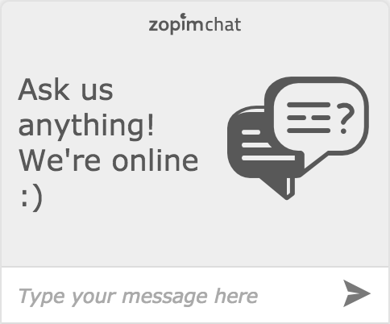
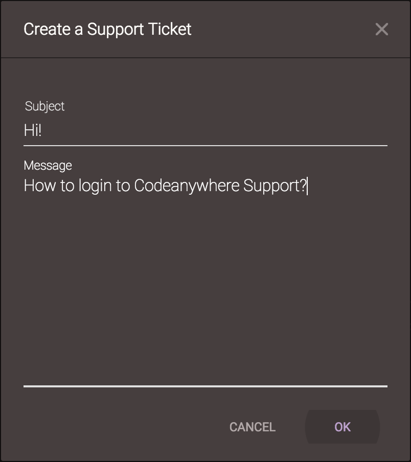
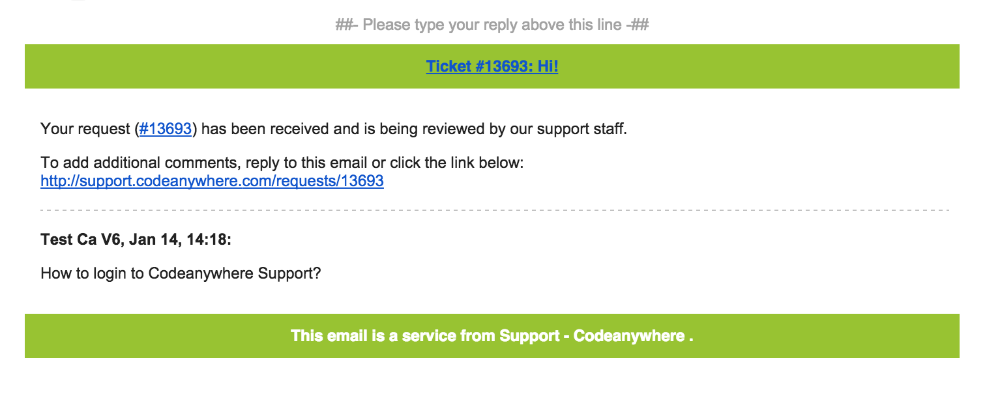
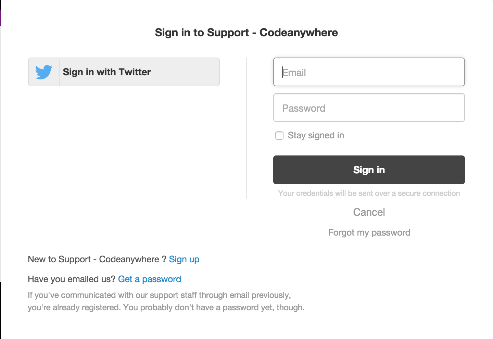
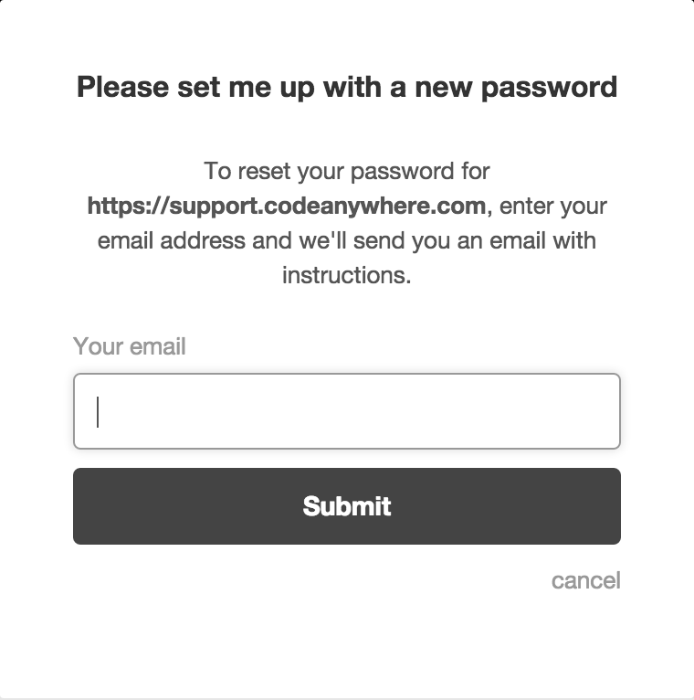
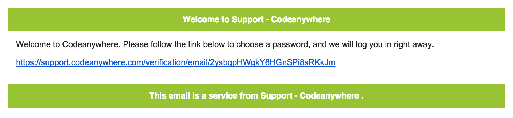
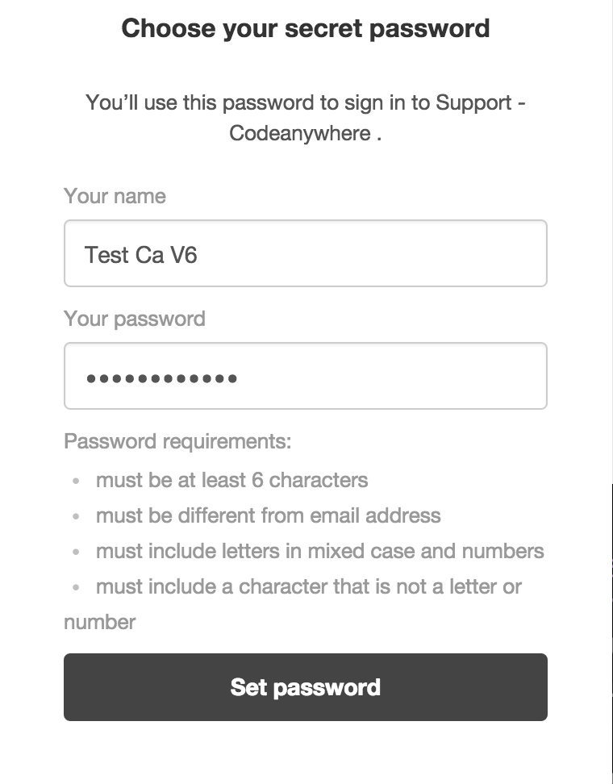

## Support

If you need any assistance, feel free to contact us and we will help you as soon as possible! 
There are several ways for you to contact us:
  1. E-mail - send in your request to [support@codeanywhere.com](mailto:support@codeanywhere.com)
  2. Editor - inside your Editor, go to Help -> Create a Support Ticket, or if you want to submit a feature request, at Help -> Suggest a Feature
  3. Chat - contact us directly from codeanywhere.com by sending us a message in your bottom left corner. Don't forget to type in your e-mail so you can receive our response
  
  

  4. Also, feel free to add us on [Twitter](https://twitter.com/Codeanywhere) or [Facebook](https://www.facebook.com/Codeanywhere/)!

  
By using any of these methods (unless we are online on chat or via social networks), you will create an ticket since we work with a Web based Support ticketing system! You can respond directly from your e-mail, or you can login to our ticketing system.

#### Login to Support

You can login to our ticketing system in order to check status of your request and our responses! 
First of all, let's say, you createad an ticket from our Editor.

You will receive an email stating that you opened an ticket.

Follow the link of your ticket (which looks like this: support.codeanywhere.com/requests/your.ticket.id)

It will take you to the login page. Click on Get a password in order to set your password in.

Enter your e-mail in the next step.

You will receive an e-mail with your unique set-password link.

Enter your name and your password, and you'll be able to login to check the status of your ticket at anytime! 