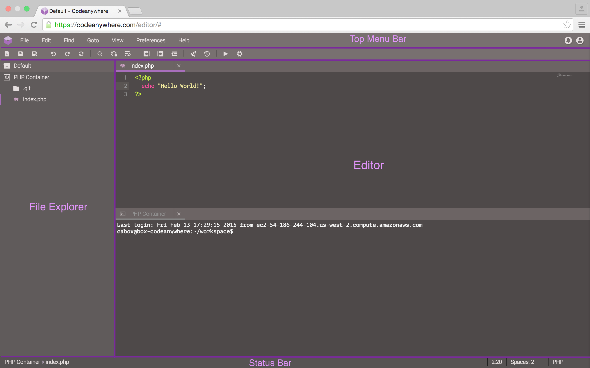

# Codeanywhere UI

Codeanywhere contains features you'd expect from traditional desktop editors. Among these include:

 - Save file option
 - Undo and Redo support
 - Cut, Copy, Paste, and Replace functionality
 - Line manipulation, including:
 
  - Indenting and outdenting
  - Moving and copying lines up or down
  - Removing lines from any point
  - Splitting lines
  
 - Highlighting and commenting blocks of code
 - Revisions
 - Code folding (including the entire file)
 - Converting cases
 - Autocompletion
 - Code analysis
 - Search in files with regular expressions
 - Line wrapping, to a defined column or the width of the browser window
 - Support for spaces and real tabs

Codeanywhere can be thought of as being divided into the following components:
1. The top menu bar is the uppermost area, with easy access to a variety of menus
2. The file explorer on the left lets you manipulate various aspects of your project, including its active files, preferences, and choices for deployment. It also displays views according to what's been selected in the file explorer
3. The editor is the main area where you write your code
4. The status bar is the bottom area of the window. It shows all sorts of information about your code

