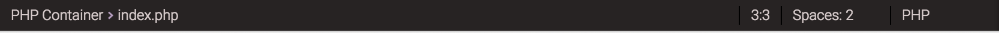

## Status Bar
 
The status bar is designed to provide you with information about your code and additional functionality without getting in the way of the Editor. 
You can find the status bar in the lower part of the editor: 
 

 
There are four pieces of information available: 
  - Position of the file which is currently opened 
  - your current row and column on the left side, which lets you know where exactly is your cursor currently placed in the code. If you click on current row, you'll be prompted to enter a line where you'd like to go.
  - Tab size let's you select your indentation
  - Top right corner detects code in the file and displays it to the user. In this way user can immediately know which programming language is being used on that file.
 
