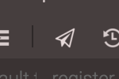

### Terminal

With Codeanywhere you get your own Terminal/Command Prompt in the cloud. This allows you to SSH directly from your browser to a different server or compile your code all without leaving your browser. Terminal can be used to run any command on your Container or remote servers. Simply right click on your connection with SSH access and select SSH terminal. 


Also, with our entirely new feature, you can collaborate directly in your terminal. Select that connection and press share in top menu bar afterwards. 



Please keep in mind that your SSH should be open. Your collaborator will receive a notification in top right corner that says: "user@mail.com has requested SSH terminal session collaboration on connection name_of_connection with you".


Use direct port access to get to Codeanywhere’s Containers via any SSH terminal or SFTP client. 

### How to connect local machine to a Container via Putty?

Here are the complete instructions for connecting to your container with Putty:

To generate a set of RSA keys with PuTTYgen: 
	1. Start the PuTTYgen utility, by double-clicking on its .exe file
	2. For Type of key to generate, select SSH-2 RSA
	3. In the Number of bits in a generated key field, specify either 2048 or 4096 (increasing the bits makes it harder to crack the key by brute-force methods)
	4. Click the Generate button 
	5. Move your mouse pointer around in the blank area of the Key section, below the progress bar (to generate some randomness) until the progress bar is full
	6. A private/ public key pair has now been generated
	7. In the Key comment field, enter any comment you'd like, to help you identify this key pair, later (e.g. your e-mail address; home; office; etc.) -- the key comment is particularly useful in the event you end up creating more than one key pair
	8. Click the Save public key button & choose whatever filename you'd like (some users create a folder in their computer named my_keys)
	9. Click the Save private key button & choose whatever filename you'd like (you can save it in the same location as the public key, but it should be a location that only you can access and that you will NOT lose! If you lose your keys and have disabled username/password logins, you will no longer be able log in!)
	10. Right-click in the text field labeled Public key for pasting into OpenSSH authorized_keys file and choose Select All
	11. Right-click again in the same text field and choose Copy.

Container config: 
	1. Log on to your container 
	2. Run: vim ~/.ssh/authorized_keys 
	3. Paste key in new line 
	4. Save and exit

Putty config: 
	1. Start PuTTY by double-clicking its executable file; 
	2. PuTTY's initial window is the Session Category (navigate PuTTY's various categories, along the left-hand side of the window); 
	3. In the Host Name field, enter the Container’s DNS (preview.xxxxx.box.codeanywhere.com) 
	4. Enter the port number in the Port field (see Container info) 
	5. Select SSH under Protocol; 
	6. Along the left-hand side of the window, select the Data sub-category, under Connection; 
	7. Specify the username cabox in the Auto-login username field; 
	8. Expand the SSH sub-category, under Connection; 
	9. Highlight the Auth sub-category and click the Browse button, on the right-hand side of the PuTTY window; 
	10. Browse your file system and select your previously-created private key; 
	11. Return to the Session Category and enter a name for this profile in the Saved Sessions field 
	12. Click the Save button for the Load, Save or Delete a stored session area.
	13. Click on the desired connection and then “connect”

### How can I connect to the SSH of my Container (Linux and OSX)?

1. open your Terminal
2. type in ssh-keygen and you will create your public key
3. go to .ssh/id_rsa.pub and copy your entire key
4. In Codeanywhere, in Container's SSH, use command: cat .ssh/id_rsa.pub
5. use command vim authorized_keys
6. (type "A" or "I") paste your key in new line and Save (by pressing ESC, and entering :wq)
7. Locate SSH port number in Container's Info

Now in order to connect to your box, you have to use the following command to create a tunnel from your local machine to your Container:
```sh
ssh -P port cabox@preview.xxx.box.codeanywhere.com -i id_rsa.pub
```
