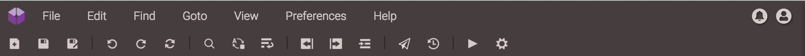

## The Top Menu Bar

In this section, you can find the usual menus for creating, opening and saving files, changing your view, and switching between windows.
 

Under the "Help" menu, there is a Change log button which will direct you to all the recent changes, link to our Documentation, Send Feedback button where you can send your comments and feedbacks about Codeanywhere, as well as link to our Terms of Service and Privacy Policy.

Notifications will show you all the changes made – once you create new file, share a file, or upload one, ect. 
On the far right you can see a Profile button. It allows you to go to your [Dashboard](https://codeanywhere.com/dashboard) (or, you can go there directly via https://codeanywhere.com/dashboard) - where you can view your subscriptions, projects and shares, change your password or delete your account - or to log off from the Editor, returning you to the Codeanywhere homepage.
