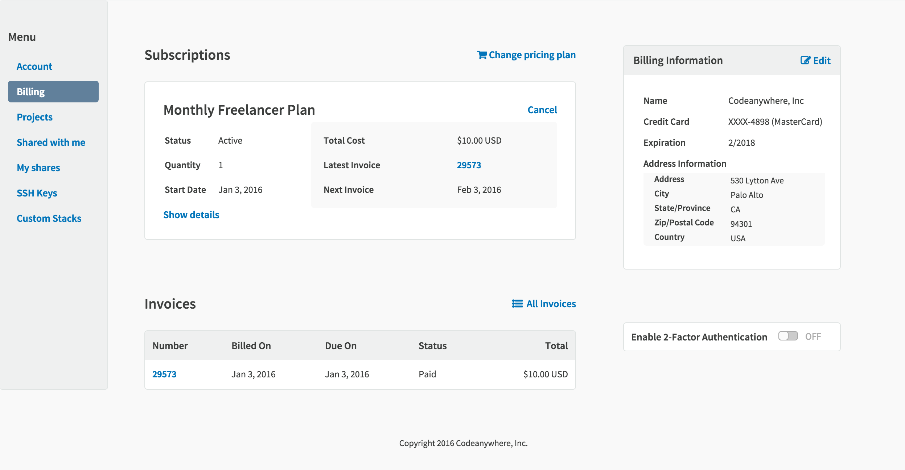
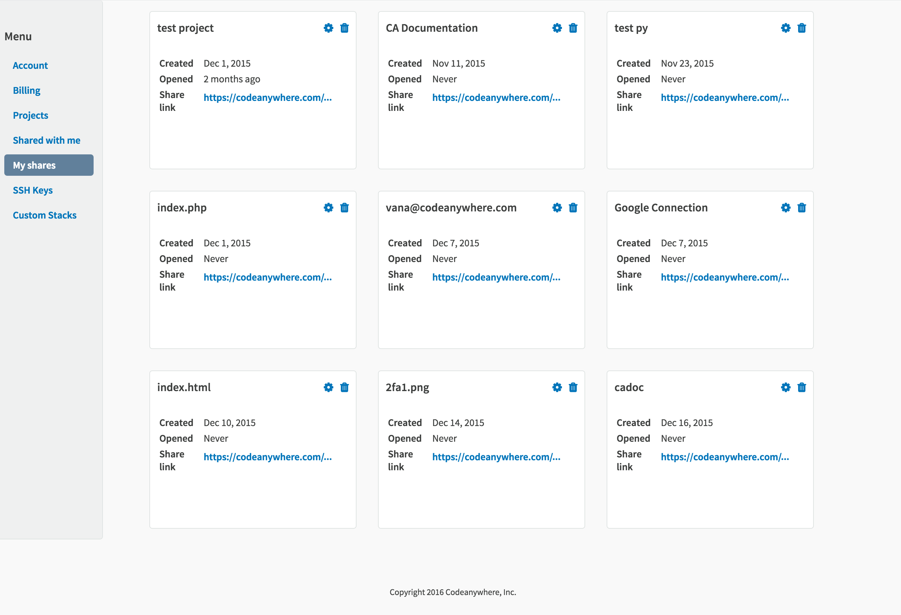
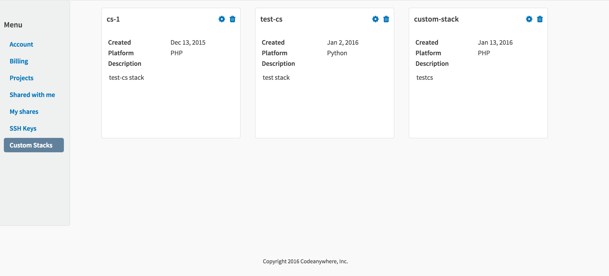

# Dashboard

You can access your Dashboard from inside your Editor – just go to top menu bar and in right corner select Profile Button 

Or you can go directly to [https://codeanywhere.com/dashboard](https://codeanywhere.com/dashboard).

Here, you can take care of all your Account details – manage your password, connect to various networks (GitHub, Bitbucket, Google or Facebook), and Delete your Account. 
 
 

Under Billing, you can manage your subscriptions and purchase add-ons, check out your invoices and billing info. Also, as a security measure, here you can activate 2FA (for Freelancer Plan and higher).
 

Projects let you organize your work and using Dashboard you can access all of them, add new ones or delete old ones!
 

With our share feature you can work on a code with other Codeanywhere users. Now, you can access all your shares from your Dashboard – Shared with me will show you all the shares you've received!
 

In My shares, you can see all the shares you have made!

Every Codeanywhere user has its own Public key and you can check yours by clicking in SSH keys. It can be used for secure communication with your server!

Under Custom Stacks, you can check all the Custom Stacks you've created inside your Editor!

