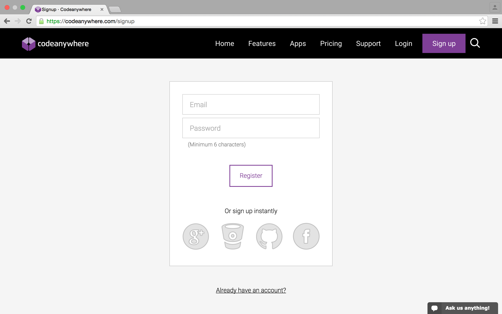
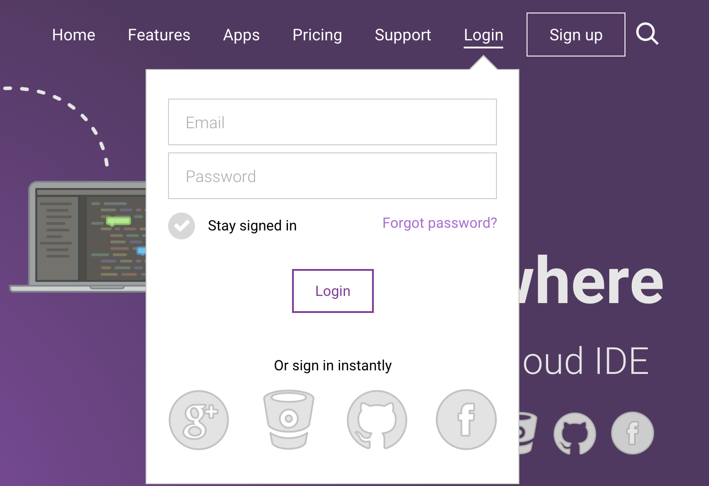
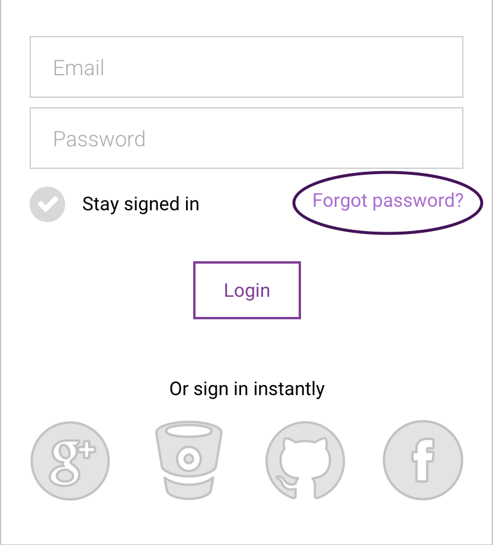

# Register/Login

To get started with Codeanywhere, just [Register](https://codeanywhere.com/signup) with an account or log in if you are already registered and go to our Editor!

## Register

You can Register with Codeanywhere by selecting Sign Up. 

Now you can choose between multiple registration methods:

- Entering your e-mail and password which will be used upon your future sign in
- Using your Google Account
- Using your Bitbucket account
- Using your GitHub account
- Using your Facebook account

In case you choose any of the oAuth methods, you'll have to authorize Codeanywhere for it to use certain features. 

## Login

You can log into your account if you already have an account. Simply choose between the method you used for registration and you'll be redirected to your Editor!

## Forgot Password

If you forget your password or have any problems while logging it to Codeanywhere you can use "Forget password?" link to reset your password. It is located below login form:

Once you receive email for your password reset, follow the link and enter the new password. After that you can use the new password and your email to login to your Codeanywhere account.