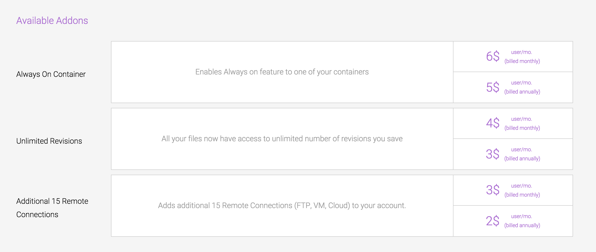
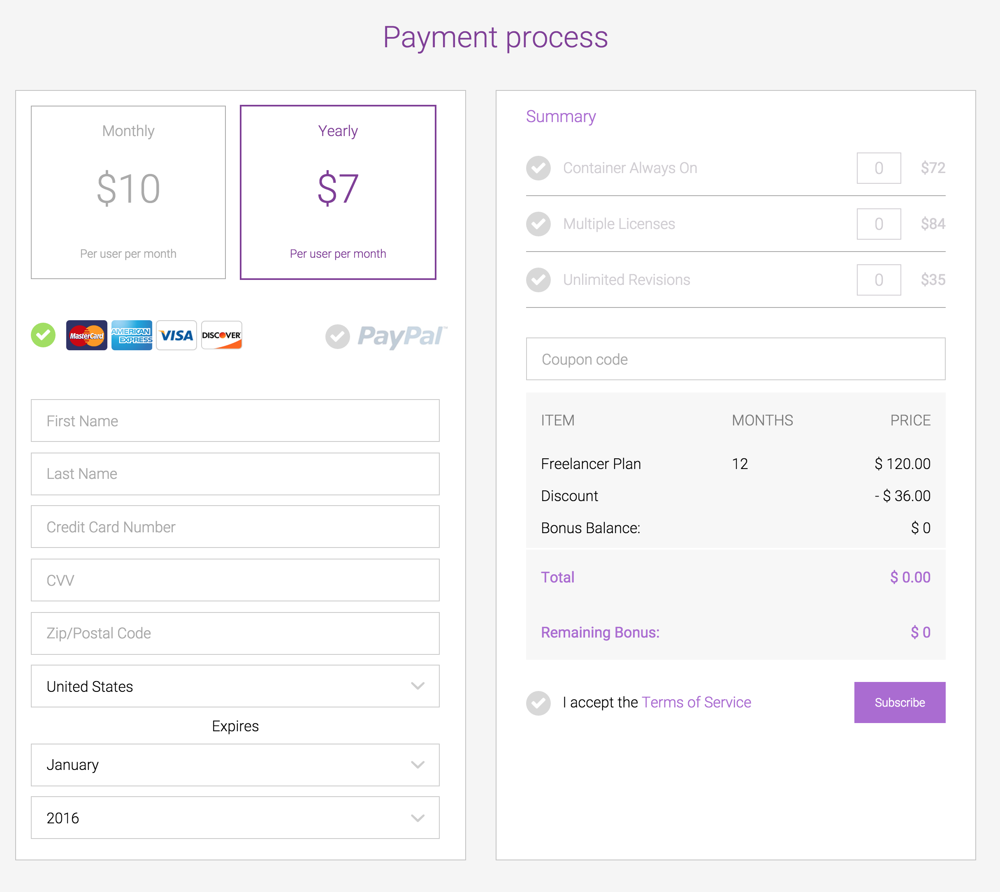
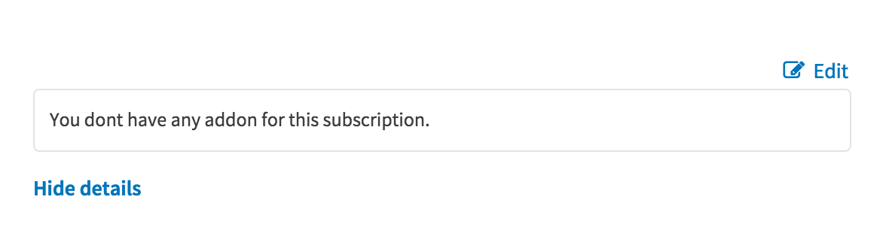
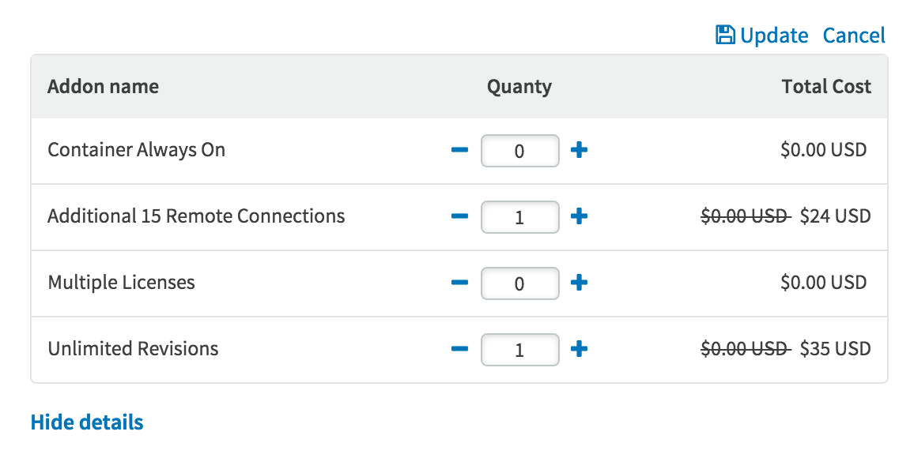

# Addons

Upon going to our [Pricing Page](https://codeanywhere.com/pricing), you can check all the Addons you can purchase, by selecting Compare Our plans, and scrolling a bit down:

As you can see, you can choose between:
 - [Unlimited Revisions](http://docs.codeanywhere.com/features/revisions.html)
 - [AlwaysON Container](http://docs.codeanywhere.com/connections/container.html)
 - [Multiple License](http://docs.codeanywhere.com/features/multiplelicense.html)
 - Additional 15 Remote Connections ([FTP/FTPs](http://docs.codeanywhere.com/connections/ftpserver.html), [SSH/SFTP](http://docs.codeanywhere.com/connections/sshserver.html), [Google Drive](http://docs.codeanywhere.com/connections/googledrive.html), [Dropbox](http://docs.codeanywhere.com/connections/dropbox.html), [AmazonS3](http://docs.codeanywhere.com/connections/amazons3.html), [DigitalOcean](http://docs.codeanywhere.com/connections/digitalocean.html))

After selecting your plan, from our Pricing Page, you will be redirected to the “Payment process” page. 

On the right side, you can select if you want to purchase any Addons.

You can, also, manage your Addons in your [Dashboard](https://codeanywhere.com/dashboard) in your Billing section. 

If you don't have any Addons, just click on Edit:

An panel will appear, where you can select number, and afterwards, click on Update:

Select the Addons you'd like an click on Proceed:

That's it! Addons are available only for Premium Plans.
 
 
