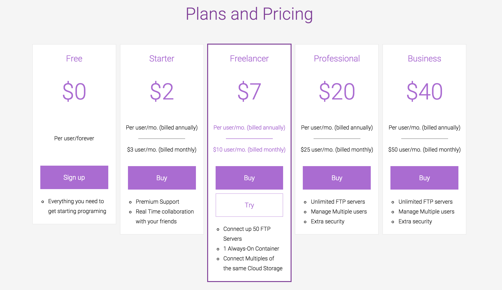

# Pricing

You can select the plan you want in our pricing page:
 

Here, you can check all the plans and view all the features you get with each plan, by just selecting Compare our plans!
After selecting your plan, you will be redirected to the “Payment process” page. There, you have the option to select between Monthly and Yearly plan packages, as well as our add-ons:
 - Unlimited Revisions
 - Always On Container
 - Multiple License

On the right side, you can choose the payment method you’d like - credit card or PayPal. When you are done, you will be redirected to the Editor and can start using our premium features immediately!
Also, if you already have an account, you can go to your Dashboard, and change pricing plan in your Billing section by selecting a subscription.

When you are done, check the "I accept the Terms of Service" and click on the "Subscribe" button and you will be redirected to Codeanywhere Editor where you can start to work.
