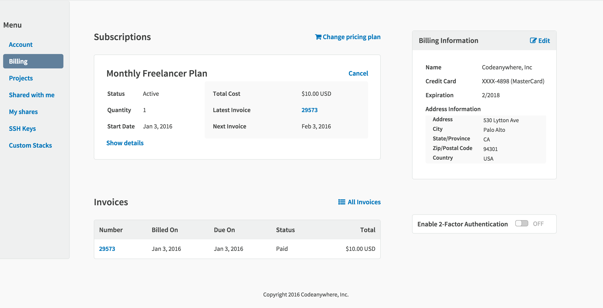
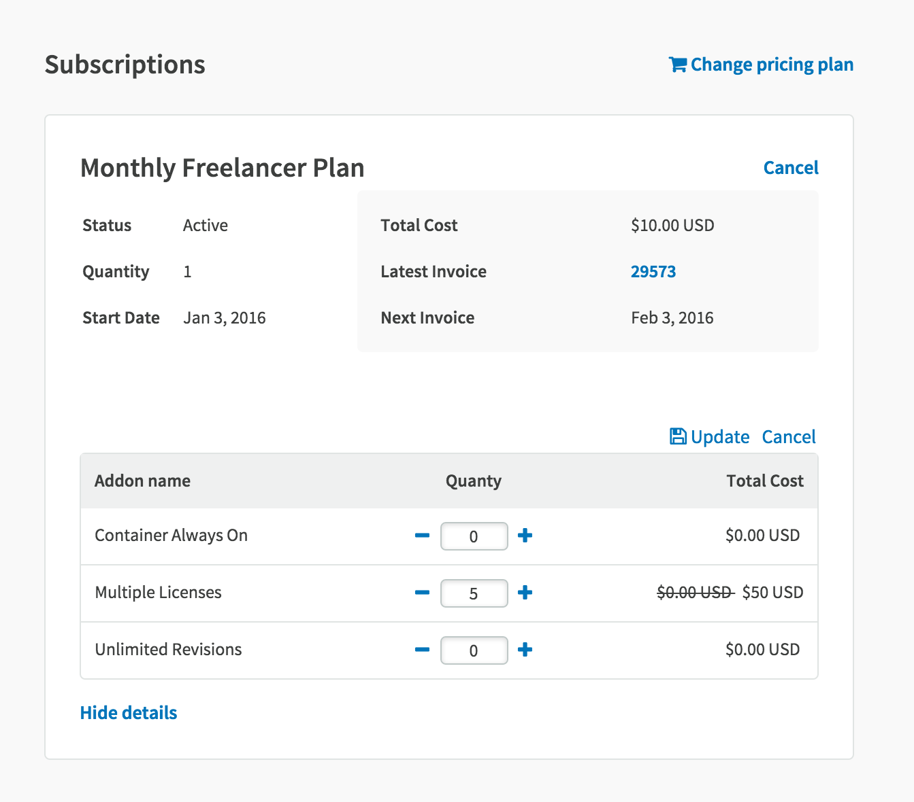
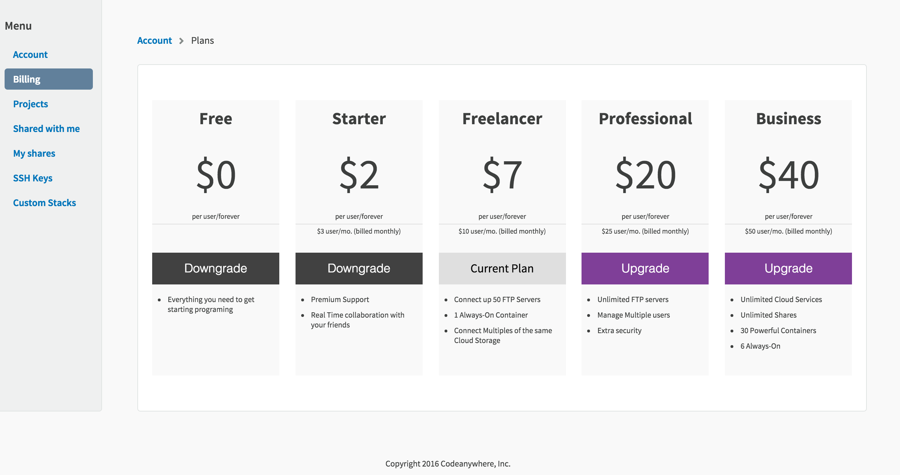

# Pricing

You can select the plan you want in our pricing page:
 

Here, you can check all the plans and view all the features you get with each plan, by just selecting Compare our plans!
After selecting your plan, you will be redirected to the “Payment process” page. 

On the left side, you can choose the payment method you’d like - credit card or PayPal. 

Also, you have the option to select between Monthly and Yearly plan packages, as well as our add-ons:
 - Unlimited Revisions
 - Always On Container
 - Multiple License

When you are done, check the "I accept the Terms of Service" and click on the "Subscribe" button and you will be redirected to Codeanywhere Editor where you can start working.

Also, if you already have an account, you can go to your Dashboard, and change pricing plan in your Billing section by selecting a subscription.

Here, you can also purchase your add-ons!

In order to change your current subscription, click on Change pricing plan and you'll be redirected. Here, you can upgrade or downgrade your current subscription! 

Refunds for downgrading your account aren't provided manually, but you'll have to contact us directly. However, keep in mind, that according to our Terms of Service, we provide refunds within seven days of the initial sign up or recurring payment.

