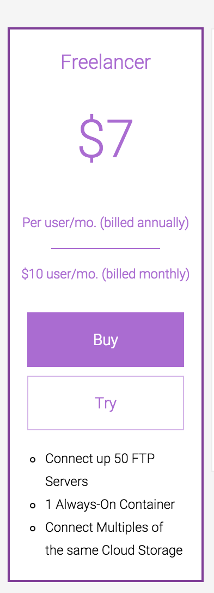

# Trial Plan

When you sign up for Freelancer premium plan (by clicking on the TRY button), you will enter the 7 day trial phase where you will have all premium features available. 

The trial phase is free, meaning you will not be billed for the premium plan you have chosen during the first 7 days so you can test and evaluate our app. If you do not like our product you can always cancel the subscription by selecting the "Change Pricing Plan" under the email menu and then selecting the "Downgrade" for the Free plan. 

Once the trial phase expires, you will be billed for the first time for the premium plan you have chosen. You will receive notification mail 3 days prior the trial phase expiration so you don't have to track the time waiting for the end of the trial phase.