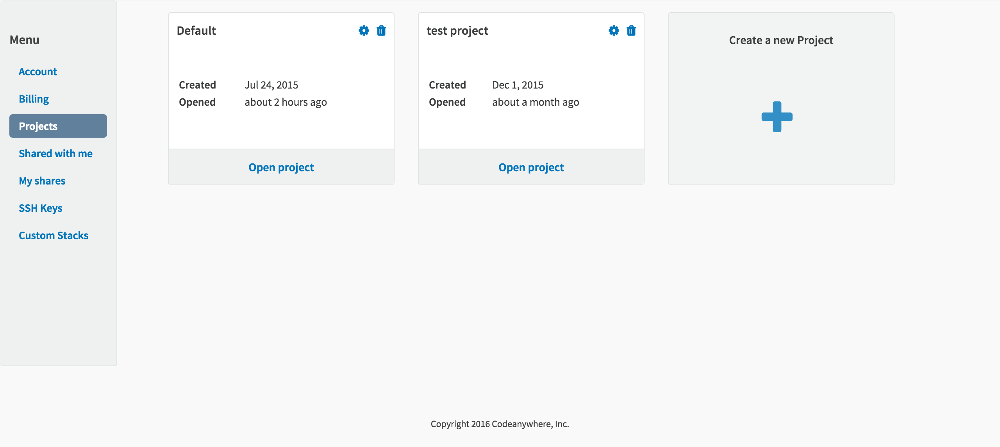

# Projects

The Project feature allows you to organize your work into separate projects and easily switch between them without having to reload or use separate tabs. You can create as many projects as you want! 
In order to view all your projects, go to your Dashboard under section Projects. Here you can open specific project, edit them, or delete. 
When inside your Editor, just right click on your Project if you want to switch to a different one. 

Here, you can also create a new one, change Config of your Project, Share a Project or Manage them - this will redirect you to your [Dashboard](https://codeanywhere.com/dashboard#project). 

