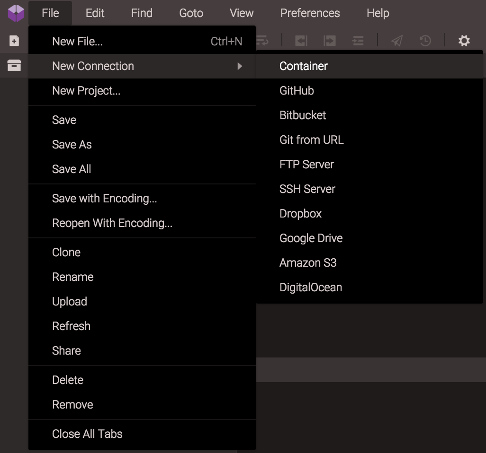
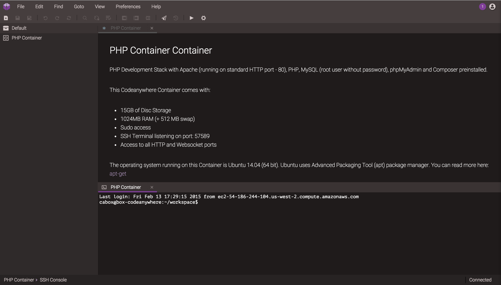
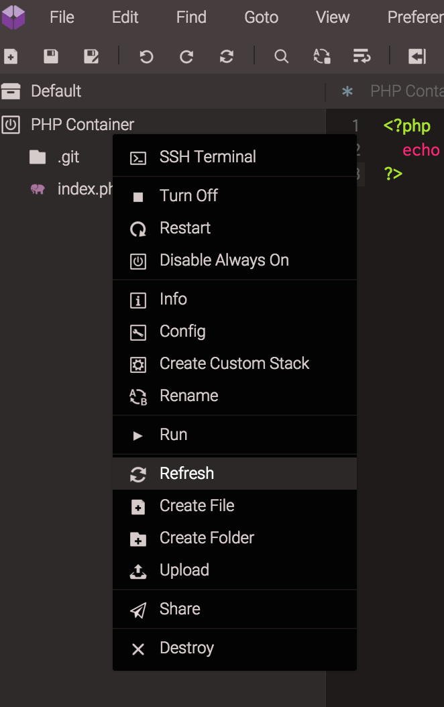
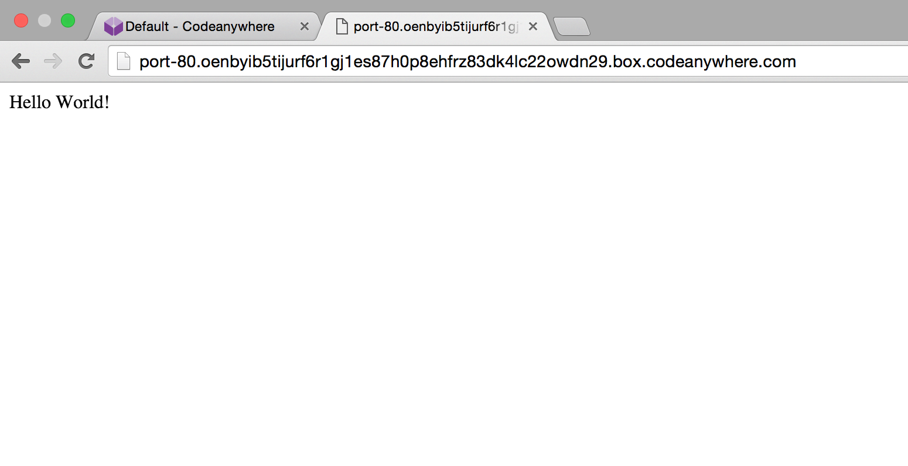

# Quick Tutorial

## Register/Login

To get started with Codeanywhere, just [Register](https://codeanywhere.com/register) with an account or [Login](https://codeanywhere.com/login) if you are already registered and go to our [Editor](https://codeanywhere.com/editor)!

## Starting up

For this tutorial, we’ll show you how to work with our [Containers](http://docs.codeanywhere.com/connections/container.html), although, you can set up your [SSH](http://docs.codeanywhere.com/connections/sshserver.html)/[FTP](http://docs.codeanywhere.com/connections/ftpserver.html) server right away, or connect to [Google Drive](http://docs.codeanywhere.com/connections/googledrive.html), [Dropbox](http://docs.codeanywhere.com/connections/dropbox.html), [Amazon S3](http://docs.codeanywhere.com/connections/amazons3.html), and even import your existing [repository](http://docs.codeanywhere.com/connections/gitfromurl.html) or create your [DigitalOcean Droplet](http://docs.codeanywhere.com/connections/digitalocean.html)!
Containers are in essence your own Virtual Private Servers which run invisibly in the background of Codeanywhere, each one with its own amount of RAM, Disk space and Processing power. Containers give you the ability to provision any Development Environment you like. You can even choose between one of the predefined stacks.

In order to start a new [Container](https://codeanywhere.com/dashboard), go to File -> New Connections -> Container.

Now, you can choose which predefined stack you’d use. In this tutorial, we’ll create an simple PHP container. Choose which OS you’d like to use - Ubuntu or CentOS - and decide whether you’d like for your Container to be Always on - meaning it will be turned on even when you’re offline. 

Wait for a few seconds until your Container is deployed, and you can start coding right away.

With a right click on your Container, choose to Create a File, and name it “index.php”.

You can see in your file tree that your Container is already updated! Go to your file and enter some code - in this example we created an simple “Hello World” app.

Save it (just like anywhere else with CMD + S, for Mac, or Ctrl + S, for Windows), and now, all you have to do is select “Run” button with a right click on your app:

and you’ll be able to preview your new app!

That’s about it! 

You can now [share](http://docs.codeanywhere.com/features/share/sharelink.html) your code or work with your colleagues in the same way you’d do that with Google Docs with our [collaboration feature](http://docs.codeanywhere.com/features/share/collaboration.html), and even [share your terminal](http://docs.codeanywhere.com/features/share/sshcollaboration.html)!
If they make some changes you’re not happy with, use our [Revisions feature](http://docs.codeanywhere.com/features/revisions.html), and get your code back to where you’d like!
Sounds interesting? Read our online documentation and learn more about the rest of the cool features we have to offer! :)
